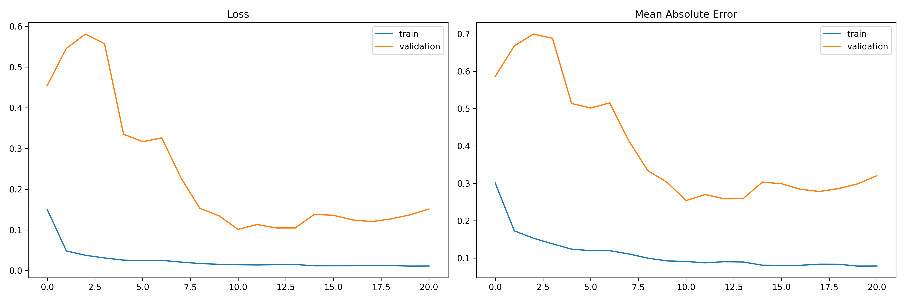
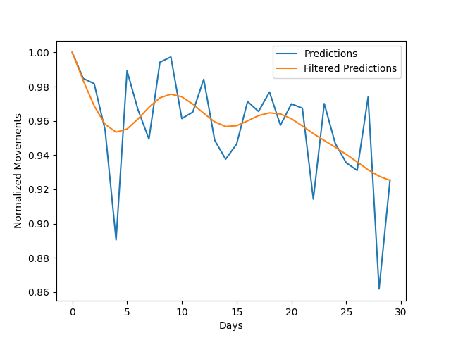

# 📉 FinancialTrendPrediction

[](https://www.python.org/downloads/)
[](https://tensorflow.org)
[](https://opensource.org/licenses/MIT)

> **Architecting the future of financial forecasting.** An advanced time-series analysis suite utilizing Stacked Long Short-Term Memory (LSTM) networks to predict technology sector trends on the NYSE.

---

## 🌟 Overview
FinancialTrendPrediction is a high-performance deep learning project designed to ingest historical market data and output reliable trend forecasts. By leveraging a multi-layered LSTM architecture, the system captures complex temporal dependencies within stock market fluctuations, enabling multi-step forecasting of future price movements.

## 🚀 Key Features
- **Stacked LSTM Architecture**: A deep neural network utilizing three consecutive LSTM layers (256, 128, and 64 units) for hierarchical feature extraction.
- **Automated Data Pipeline**: Seamless integration with Yahoo Finance API for real-time historical data acquisition.
- **Multi-Step Forecasting**: Unlike traditional models that predict the next single point, this system targets a **30-day forecast horizon**.
- **Intelligent Preprocessing**: Robust data normalization and sequence generation tailored for financial time-series.
- **Performance Optimized**: Built-in suppressors for native TensorFlow overhead, optimized for modern hardware (including macOS M1/M2 silicon).
- **Modular Design**: Clean separation of concerns between training, data processing, and visualization in the v0.2 release.

---

## 🏗 Model Architecture
The core engine is a sophisticated Stacked LSTM model implemented in TensorFlow/Keras:

| Layer | Type | Specifications |
| :--- | :--- | :--- |
| **Input** | Sequence | 400 Timestep Lookback |
| **Encoder L1** | LSTM | 256 Units, Tanh Activation, Multi-Sequence Output |
| **Regularization**| Dropout | 20% |
| **Encoder L2** | LSTM | 128 Units, Tanh Activation, Multi-Sequence Output |
| **Regularization**| Dropout | 20% |
| **Bottleneck** | LSTM | 64 Units, Tanh Activation |
| **Output** | Dense | 30 Timestep Forecast (Linear) |

---

## 📊 Visual Insights
### Training Performance

*Insight into the model's convergence during training sessions.*

### Trend Prediction

*A visual comparison of predicted vs. actual market trends.*

---

## 🛠 Tech Stack
- **Languages**: Python
- **ML Framework**: TensorFlow, Keras
- **Data Science**: NumPy, Pandas, Scikit-learn
- **Visualization**: Matplotlib
- **API**: Yahoo Finance (`yfinance`)

---

## 🚦 Getting Started

### Prerequisites
- Python 3.8 or higher
- Pip (Python package installer)

### Installation
1. **Clone the repository**:
   ```bash
   git clone https://github.com/Tomip123/FinancialTrendPrediction.git
   cd FinancialTrendPrediction
   ```

2. **Install dependencies**:
   ```bash
   pip install -r requirements.txt
   ```
   *(Note: Ensure requirements.txt includes tensorflow, yfinance, pandas, numpy, matplotlib, scikit-learn)*

3. **Running the latest version (v0.2)**:
   ```bash
   cd v0.2
   chmod +x run.sh
   ./run.sh
   ```

---

## 📈 Evolution: v0.1 vs v0.2
| Feature | v0.1 (Legacy) | v0.2 (LTS) |
| :--- | :--- | :--- |
| **Structure** | Script-heavy, flat directory | Modular, package-based architecture |
| **Data Handling** | Manual CSV management | Automated caching & API integration |
| **Model** | Basic LSTM | Deep Stacked LSTM with Dropout |
| **Logging** | Standard verbose output | Suppressed native logs for speed |
| **Predictability**| 1-step forecast | 30-step trend forecasting |

---

## 🤝 Contributing
Contributions are welcome! If you have suggestions for improving the model architecture or expanding the dataset, please feel free to fork the repo and submit a pull request.

## 📄 License
This project is licensed under the MIT License - see the [LICENSE](LICENSE) file for details.

---
*Disclaimer: This project is for educational and research purposes only. Financial markets involve significant risk. Never use this software for actual trading decisions.*
